# 🗄️ WiVault – Next.js + Appwrite File Vault

Welcome to **WiVault**, your modern platform for managing cloud files, with secure authentication, file uploads, profile editing, and a polished user experience.

👉 **[LIVE DEMO HERE](https://wivault.vercel.app/)**

---

## 🚀 Features

✅ Login, signup, and logout  
✅ OTP verification for secure access  
✅ File search bar  
✅ Modern sidebar navigation with integrated settings (change name/avatar)  
✅ Cloud storage with file organization by type  
✅ Share files between users  
✅ Rename, view details, or delete uploaded files  
✅ View latest uploaded files  
✅ Global analytics dashboard  
✅ Minimalist and clean UX/UI

---

## ⚙️ Tech Stack

### 💻 Frontend

- ⚡️ [Next.js 14](https://nextjs.org/) (App Router)
- 🎨 [Tailwind CSS](https://tailwindcss.com/) – fast and modern styling
- 🧩 [shadcn/ui](https://ui.shadcn.com/) – accessible and customizable components
- 🖼️ [Next/Image](https://nextjs.org/docs/pages/api-reference/components/image) – image optimization
- ✨ [TypeScript](https://www.typescriptlang.org/) – static typing

### 🛠️ Backend & Infra

- ☁️ [Appwrite](https://appwrite.io/) – backend as a service (auth, storage, users)
- 🗄️ [Appwrite Storage](https://appwrite.io/docs/products/storage) – file and avatar management
- 🔒 Secure authentication and user management

---

## 🖼️ Screenshots

#### 🏠 Main Dashboard
Overview of files and sidebar navigation.

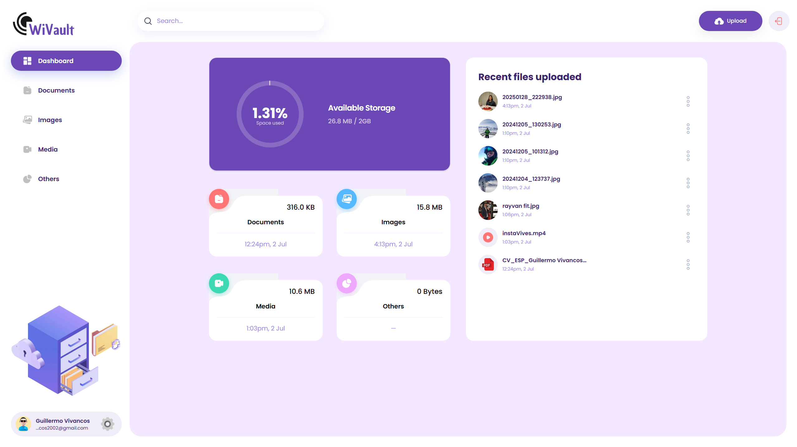

#### 📸 App implementations

#### Login Page
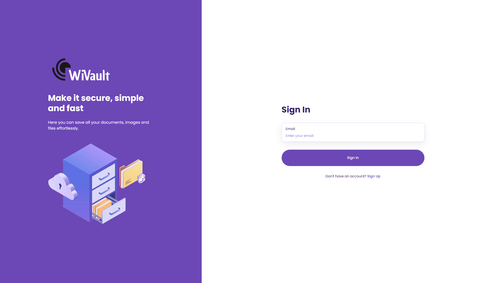

#### Register Page
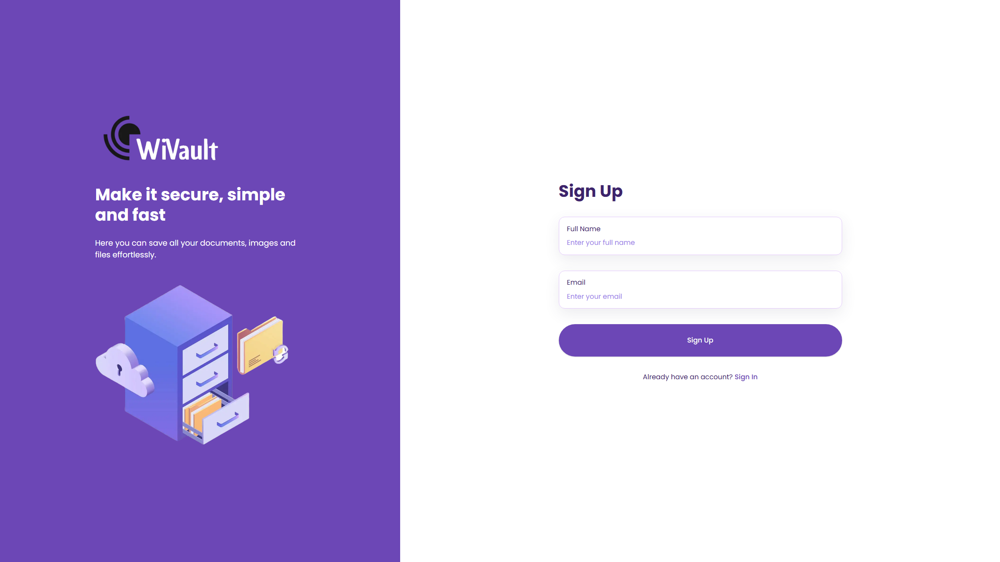

#### OTP Verification
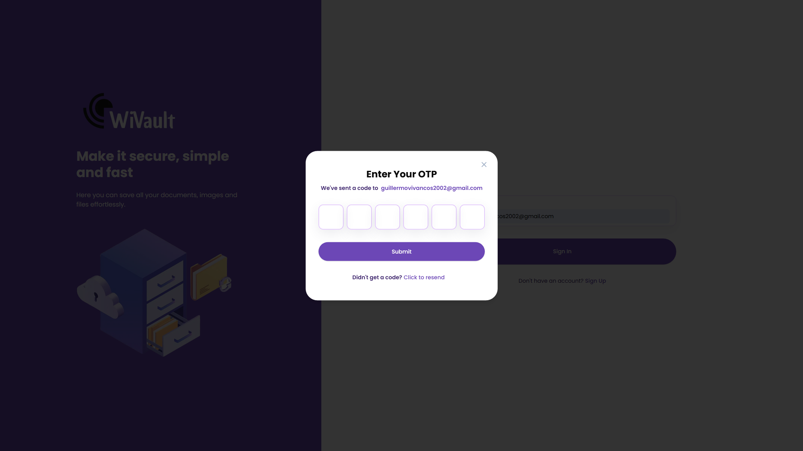

#### Images View
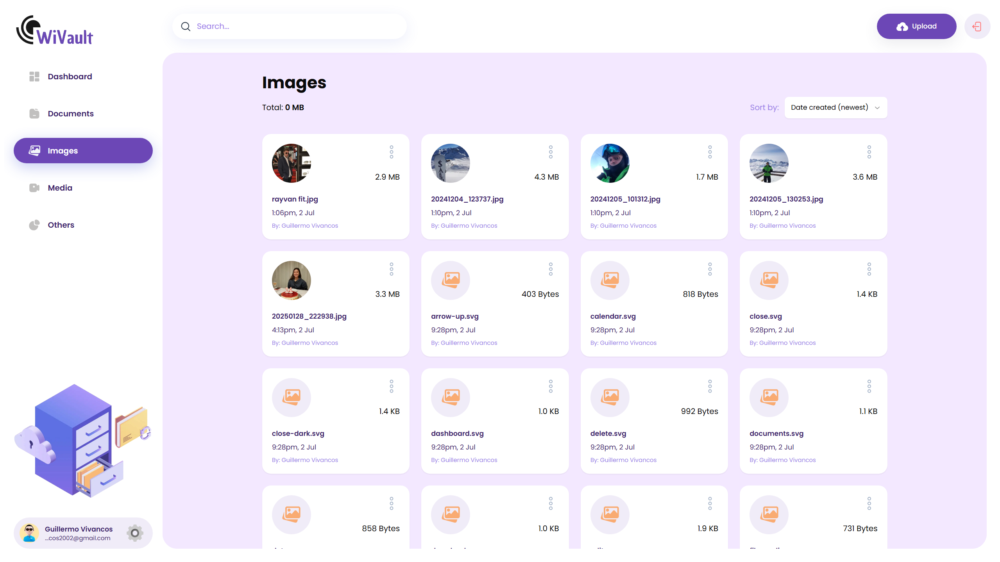

#### Videos View
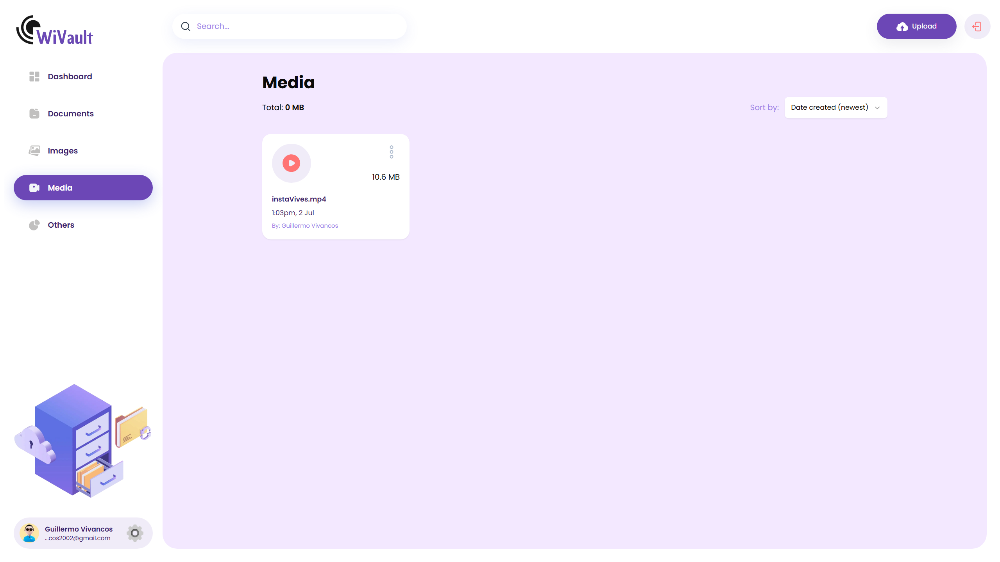

#### Documents View
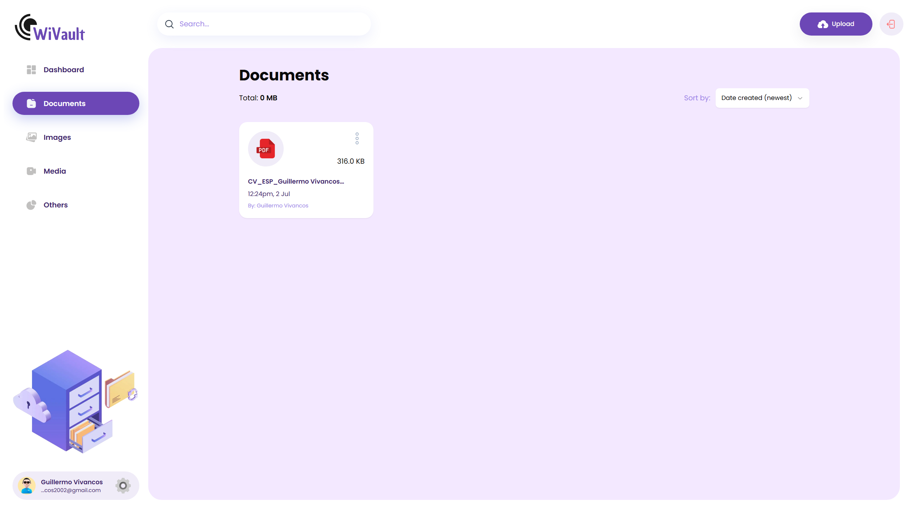

#### Edit File
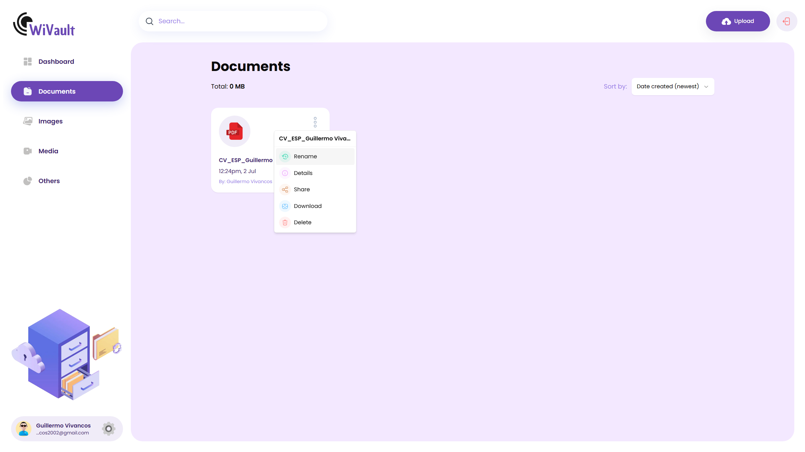

#### File Details
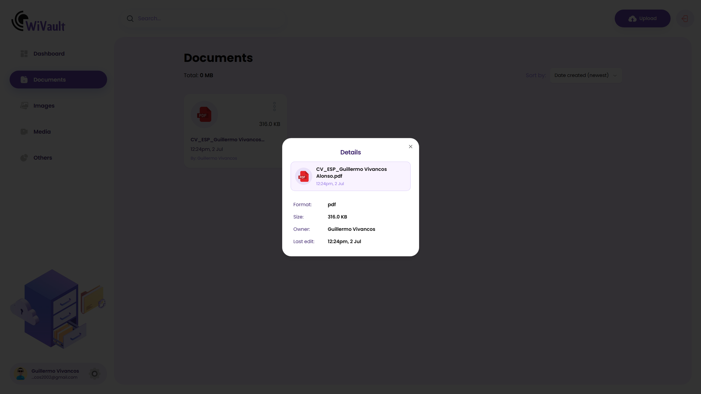

#### Rename File
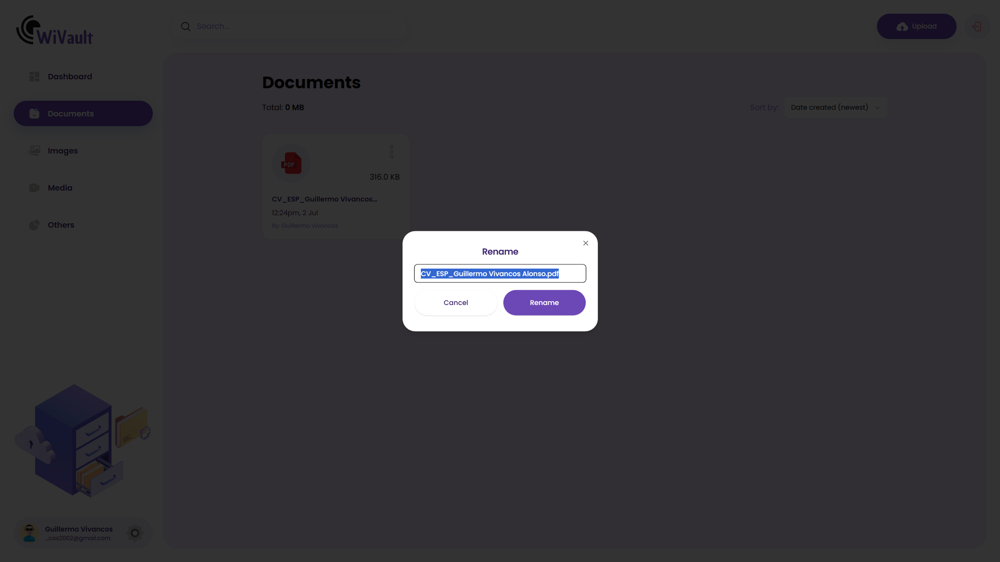

#### Share File
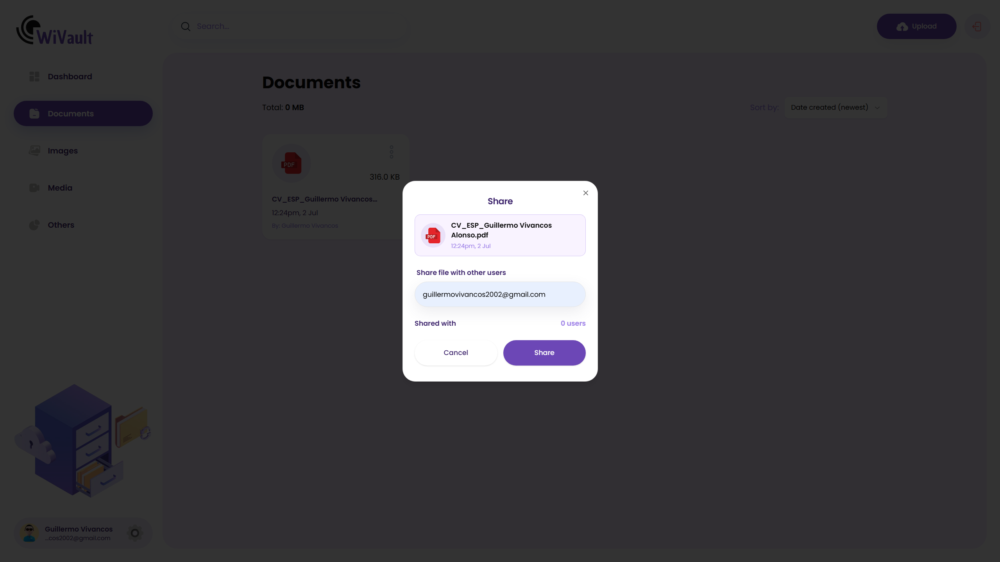

#### Upload File
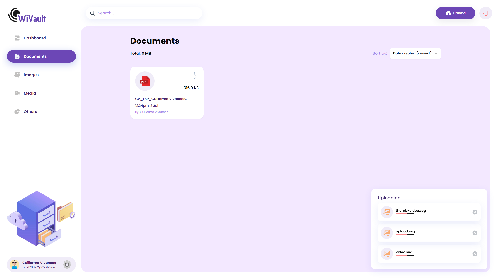

#### Settings Modal
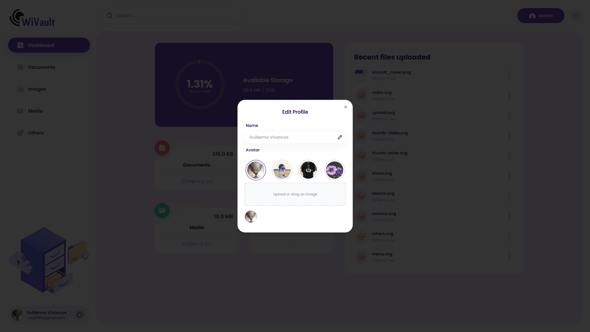

#### Settings Changed
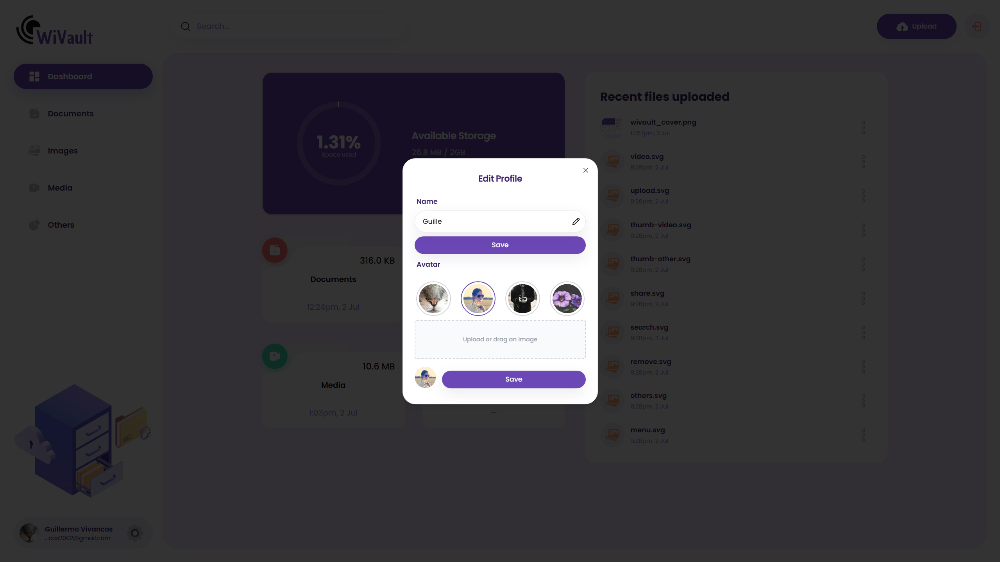

---

## 📂 Run Locally

### 1. Clone the repository

```bash
git clone https://github.com/your-username/wivault.git
cd wivault
```

### 2. Install dependencies

```bash
npm install
```

### 3. Configure environment variables

Create a `.env.local` file in the root with your Appwrite credentials:

```
NEXT_PUBLIC_APPWRITE_ENDPOINT=...
NEXT_PUBLIC_APPWRITE_PROJECT=...
NEXT_PUBLIC_APPWRITE_DATABASE_ID=...
NEXT_PUBLIC_APPWRITE_BUCKET_ID=...
```

> See the Appwrite documentation for these values.

### 4. Start the development server

```bash
npm run dev
```

The app will be available at [http://localhost:3000](http://localhost:3000)

---

## 📢 Notes

- Example images are in `/public/assets/images/` and `/public/assets/thumbnails/`.
- You can customize the default avatars by editing the logic in the settings modal.
- The Appwrite backend must be running and accessible from your local environment.

---

Ready to try WiVault?  
Clone, configure, and start managing your cloud files in style!

